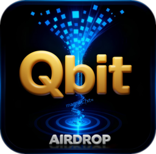

<!--
   PROJECT HEADER
-->

  <a href="https://github.com/InvenioX3/qbit_airdrop">
    <!-- PROJECT ICON PLACEHOLDER -->
    
  </a>

<h1 align="center">Qbit AIRDROP - <i>Easy</i> magnet submission and qBittorent torrent management in Home Assistant</h1>

  <!-- BADGES: COLORS & LINKS -->
  
  
  
  
  
  

  <!-- QUICK META LINKS -->
  <a href="#overview"><strong>Overview</strong></a> ·
  <a href="#features"><strong>Features</strong></a> ·
  <a href="#installation"><strong>Installation</strong></a> ·
  <a href="#configuration"><strong>Configuration</strong></a> ·
  <a href="#services--endpoints"><strong>Services & Endpoints</strong></a> ·
  <a href="#lovelace-card"><strong>Lovelace Card</strong></a> ·
  <a href="#related-repositories"><strong>Related Repos</strong></a>

---

**Qbit AIRDROP** - <i>Auto-parse & submit on paste</i> - a Magnet links is sent to qBittorrent with cleaned category and save location.

Used in conjuction with the <a href="https://github.com/InvenioX3/qbit_airdrop_card"><strong>Qbit AIRDROP Card</strong></a> Lovelace card, it provides a clean, mobile optimized UI for submitting magnet links and managing torrents directly from a dashboard.

  - **Note: This integration assumes qBitorrent's webUI authentication is disabled.**

## Overview & Features

- Submitting magnet links to qBittorrent through the **Qbit AIRDROP integration**
  - Tap the general area of the **logo** and paste a `magnet:?` URL
    - `magnet:?` is detected, parsed for show/movie title strings, and appends the cleaned title to the default save location for the Qbit integration
      -  e.g. `//NAS/TV-Shows/` for series
      -  Non-series items are saved in the default location set in the qBitorrent client
    - qBitorrent client automatically creates the category and directory based on the save location
- Managing torrents directly from this card
  - Tapping the `State` column (leftmost) deletes the selected torrent and all related files, with optional confirmation prompt
  - Tapping the `Size` field removes the selected torrent and retains all related files
- Refreshing the list
  - Tapping the "`Qbit AIRDROP`" section of the logo triggers a refresh of the torrent list

  - Further instruction, including installation of the lovelace card can be found here:
<a href="https://github.com/InvenioX3/qbit_airdrop_card/blob/main/README.md"><strong>Qbit AIRDROP Card</strong></a>

---

## Features

- **Direct qBittorrent WebUI integration**
- **Magnet submission service**
  - `qbit_airdrop.add_magnet` accepts a magnet link
  - - Cleans the string and determines if it is a unique file or episodic
    - Submits the magnet with both category and save path
    - qBittorrent automatically creates that folder as the download location

## Requirements

- Home Assistant (core) with the ability to install custom integrations
- HACS installed and configured
- A reachable **qBittorrent** instance with WebUI enabled:
  - Host and port accessible from your Home Assistant instance

---

## Installation

### 1. Install via HACS

1. Open **HACS → Integrations**
2. Add this repository as a **Custom Repository**:
   - Repository: `https://github.com/InvenioX3/qbit_airdrop`
   - Category: `Integration`
3. Search for **Qbit AIRDROP** in HACS and `download` it
4. Restart Home Assistant when prompted
5. Go to `Setting`->`Devices & services`->`Add integration` and search for **qbit_airdrop** and install it
   - Enter the **`HOST_IP:PORT`** and default save location, e.g. `//NAS/TV_SHOWS/`

---

## Services & Technical Architecture

### Home Assistant domain and services

This integration registers the `qbit_airdrop` domain in Home Assistant and currently exposes a single public service:

- **Service**: `qbit_airdrop.add_magnet`  
  - **Fields**
    - `magnet` (string, required) – the raw `magnet:?` URI to submit.
  - **Behavior**
    - Normalizes and parses the incoming magnet URI.
    - Derives a cleaned title from the tracker metadata (used for folder/category naming).
    - Resolves an effective save location from:
      - The base path configured in the integration (e.g. `//NAS/TV_SHOWS/`).
      - The parsed title and simple “series vs one-off” heuristics.
    - Forwards the request to qBittorrent’s WebUI API with the derived `savepath` and `category`.

Automations and scripts should call `qbit_airdrop.add_magnet` directly rather than trying to talk to qBittorrent themselves.

---

### Communication with qBittorrent WebUI

All interaction with qBittorrent happens via its HTTP WebUI API (`/api/v2/...`) using the `host` and `port` configured when you set up this integration.

On magnet submission (`qbit_airdrop.add_magnet`):

- The integration builds a request equivalent to:

  - **Endpoint**

    - `POST http://<host>:<port>/api/v2/torrents/add`

  - **Form fields (core subset)**

    - `urls` – the raw magnet URI.
    - `savepath` – the fully-qualified path composed from your configured base path and the cleaned title.
    - `category` – a derived or default category associated with that save path.

- qBittorrent’s own category/save-path logic then takes over to:
  - Create the category if needed.
  - Create the on-disk folder.
  - Apply any per-category defaults you have configured in qBittorrent itself.

No direct database access or filesystem manipulation is performed by this integration; it always goes through the official WebUI API.

---

### Internal REST endpoints (for the Lovelace card)

For the companion Lovelace card, the integration exposes a small REST surface via Home Assistant’s HTTP server. These endpoints are considered **internal** and may change between releases, but conceptually they map as follows:

- **Torrent listing**
  - A GET endpoint returns the current torrent list in JSON form.
  - Under the hood this proxies qBittorrent’s `torrents/info` WebUI API to retrieve status, size, progress, category, etc.

- **Torrent deletion**
  - A POST endpoint accepts:
    - One or more torrent identifiers (hashes).
    - A flag indicating whether files on disk should also be removed.
  - This is forwarded to qBittorrent’s `torrents/delete` WebUI API with the appropriate `deleteFiles=true/false` semantics.

These REST endpoints are only used by the Qbit AIRDROP Lovelace card; they are not intended as a stable public API. If you need more advanced control from automations, you can combine:

- Home Assistant’s `qbit_airdrop.add_magnet` service for submission.
- Direct calls to qBittorrent’s WebUI API from your own tooling for niche operations.

---

### State and update model

- The integration is intentionally **service-oriented**: it focuses on submitting and managing torrents rather than exposing a large number of Home Assistant entities.
- Torrent state and metadata are fetched on demand for the REST endpoints used by the Lovelace card, rather than being stored as long-lived sensors.
- There are no inbound webhooks; all traffic is initiated by Home Assistant towards qBittorrent’s WebUI API.
